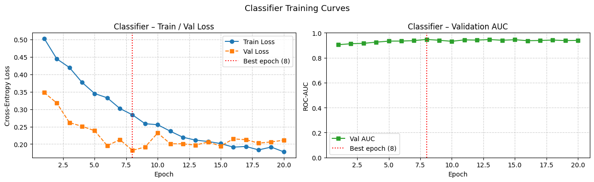
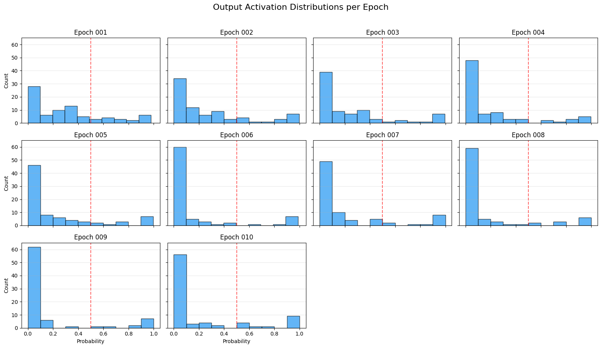
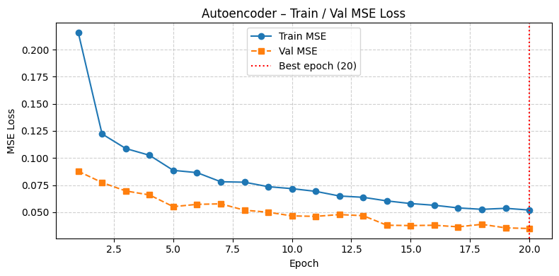
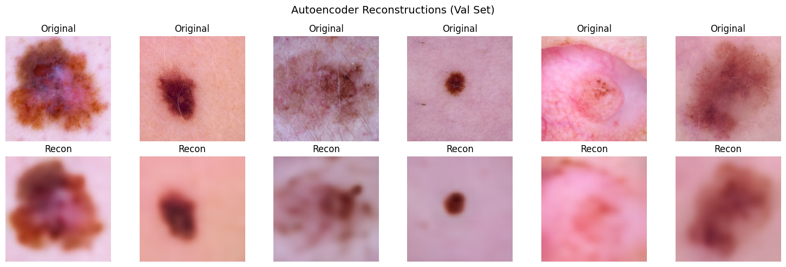
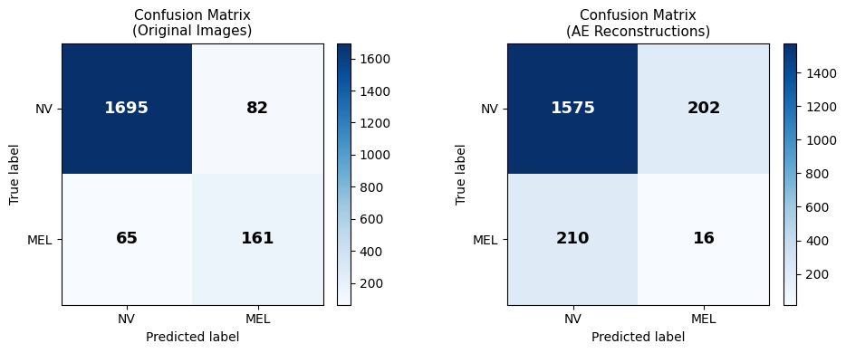

# Weekly Progress Report

## Project Objectives

The goal is to build a tool that helps clinicians decide whether to trust a classifier's prediction on a specific image. Given a skin lesion image, we encode it into a compact latent space, then move through that space in directions that hold the classifier's confidence constant. Decoding those points back into images shows what can change while the prediction stays the same, and where it breaks. The core output is a "boundary image" - the closest plausible image at which the classifier flips its prediction. A clinician can look at this image and judge whether the flip makes sense visually.

The method has three independent components: an autoencoder, a classifier, and a traversal algorithm. Any of the three can be swapped without retraining the others.

## 1. Classifier

### Dataset Selection

We first targeted ISIC 2020 (33k images, biopsy-confirmed binary labels). The malignant class was 1.7% of the data (~580 images). Even with weighted loss, the classifier overfit the malignant training samples and did not generalise.

We switched to HAM10000 (ISIC 2018), which has 10,015 images across 7 classes. Collapsing to binary (benign/malignant) gives a more tractable 20% malignant rate. However, the ABCD dermoscopic criterion - which we use for human evaluation of traversal results - applies only to melanocytic lesions. Training a binary benign/malignant classifier would mean evaluating traversal results with a criterion that does not apply to most of the classes. We therefore restricted training to **melanoma (MEL, n=1113) vs melanocytic nevus (NV, n=6705)**, the two classes for which ABCD is designed.

### Training

- Backbone: EfficientNet-B0, ImageNet pretrained
- Loss: BCEWithLogitsLoss with pos_weight to correct class imbalance
- Data: augmentation (flips, rotations, colour jitter) and weighted random sampling
- Result: **ROC AUC 0.946 on validation set**
- Output distribution: heavily bimodal (mass near 0 and 1, little probability in the middle region)

### Outstanding Issue: Bimodal Output Distribution

For traversal to work, the classifier needs a smooth confidence surface - a gentle gradient across latent space with a clear boundary. The current bimodal distribution means most latent points get near-zero gradient, with a sudden jump at the boundary. This makes traversal paths hard to follow and boundary images hard to find reliably.

Planned fix: **label smoothing** (replacing 0/1 targets with 0.1/0.9). This directly penalises overconfident predictions and should push probability mass into the middle region without changing the model architecture.

*The output distribution is heavily bimodal, with most predictions near 0 or 1 and little probability in the middle region. This makes traversal paths hard to follow and boundary images hard to find reliably.*

## 2. Autoencoder (vanilla for baseline testing)

### Architecture

- Encoder: EfficientNet-B0 backbone (ImageNet pretrained, lower layers frozen)
- Decoder: symmetric ConvTranspose2d layers, 7x7 -> 224x224 in 5 upsampling steps
- Training: same augmentation and weighted sampling pipeline as the classifier (to ensure equal reconstruction quality across MEL and NV)

### Results

Reconstruction loss is acceptable, but reconstructed images are blurry. This matters because border irregularity is one of the four ABCD criteria - if the decoder smooths borders, the traversal results cannot be visually verified by a human rater.

To quantify the severity: the classifier scores **ROC AUC 0.59** on autoencoder reconstructions (vs 0.946 on real images), with precision and recall near 0.07. The reconstructions are degraded enough that the classifier treats them as near-random. This must be fixed before traversal results can be trusted.

### Planned Fixes

In order of priority:

1. **L1 loss** instead of L2 - L2 penalises large errors quadratically, which encourages averaging (blurry). L1 is linear and preserves sharper detail.
2. **Perceptual loss** - penalise differences in VGG feature space rather than pixel space. VGG features encode edges and textures explicitly, which directly addresses border blurriness.
3. **SSIM loss** - penalises loss of local structure and contrast.
4. **Architectural: replace ConvTranspose2d with Upsample + Conv2d** - transposed convolutions produce checkerboard artifacts. Bilinear upsampling followed by a regular conv is cleaner.
5. **Adversarial loss** - add a small discriminator to force sharp outputs. Most complex option; held in reserve.

Note: skip connections (U-Net style) are not suitable here because the method requires all information to pass through the bottleneck. The bottleneck is the latent point we traverse.

### Open Question: Classifier-in-the-Loop Loss

One option is to add the classifier's prediction error on reconstructions as a term in the AE loss. This would directly incentivise the decoder to preserve classifier-relevant features. The downside is that it ties the AE to one specific classifier, which breaks the modularity the method depends on. If used, reconstruction loss would still need to be tracked independently to verify the AE is not just learning to fool the classifier.

## 3. Latent Space Traversal

Initial along/against gradient traversal has been run. Several problems are visible:

- **Non-monotonic confidence along the gradient direction** - classifier confidence goes up and down rather than changing smoothly. Partly a classifier calibration issue; partly an AE quality issue.
- **Non-uniform step sizes** - the same step size in latent space produces vastly different magnitudes of visual change in different regions. The latent space is not well-structured for traversal. Perceptual loss during AE training may help by encouraging a more uniform latent geometry.
- **Synthetic-looking generated images** - a raw convolutional AE is not designed for generative tasks. Moving to a VAE or adversarial autoencoder is the natural next step once the baseline pipeline is stable.

*NV traversal: generated images appear synthetic. The same step size applied to a MEL image produced little visible change in the reconstruction, demonstrating non-uniform step sizes across the latent space.*

**Key principle going forward:** before exploring directions perpendicular to the gradient, first confirm that traversal along and against the gradient produces monotonically changing confidence and visually coherent images. The perpendicular directions are only meaningful once the gradient direction is validated.

## Next Steps

| Area | Action |
|---|---|
| Classifier | Add label smoothing; re-evaluate output distribution |
| AE | Add L1 + perceptual loss; re-evaluate classifier AUC on reconstructions |
| AE architecture | Trial VAE or adversarial AE for sharper, more structured latent space |
| Traversal | Validate gradient direction before perpendicular exploration |
| Traversal | Investigate PCA on latent activations for orthogonal direction selection |